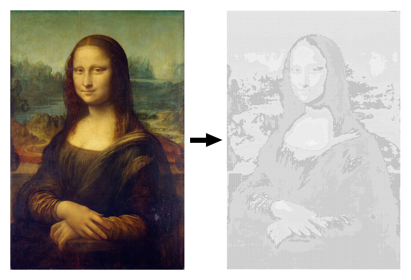

## Convert images to ASCII art

These Xamarin.iOS and Xamarin.Droid libraries allow you to convert images to ASCII art. There are extension methods that simply return a string containing ASCII art.

### Sample



### Usage on Xamarin.iOS

```c#
using ASCIILogger.iOS;

UIImage image = ...
string ascii = image.Asciify();

// Or set maximum image size. Default is 200.
string ascii = image.Asciify(500);
```

### Usage on Xamarin.Droid

```c#
using static ASCIILogger.Droid.ASCIILogger;

// Take image straight from resources
string ascii = Asciify(Resource.Drawable.my_image, Resources);

// Or use extension method on Bitmap class
Bitmap bitmap = ...
string ascii = bitmap.Asciify();

// Or use extension method on Drawable class
Drawable drawable = ...
string ascii = drawable.Asciify();

// All previous methods have a default parameter which is maximum image size. 
// Default is 200.
```

### Setup

Available on NuGet:
* [ASCIILogger.iOS](https://www.nuget.org/packages/ASCIILogger.iOS/)
* [ASCIILogger.Droid](https://www.nuget.org/packages/ASCIILogger.Droid/)

